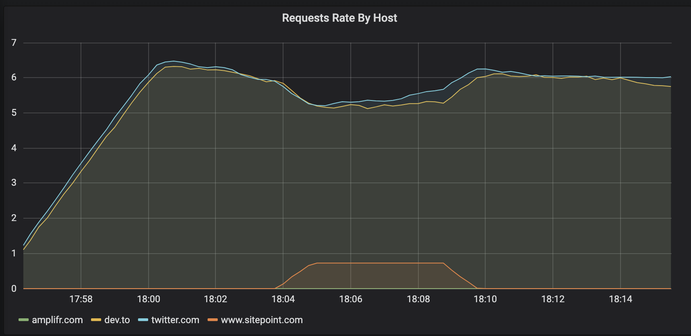

<a href="https://amplifr.com/?utm_source=yabeda-http_requests">
  
</a>

# Yabeda::HttpRequests

Built-in metrics for external services HTTP calls! This gem is a Part of the [yabeda](https://github.com/yabeda-rb/yabeda) suite.

## Metrics

Works as the Puma plugin and provides following metrics:
 - `http_requests_total_count` - the number of made external HTTP requests (by host, port, query)

## Installation

Add this line to your application's Gemfile:

```ruby
gem 'yabeda-http_requests'
```

And then execute:

    $ bundle install

Or install it yourself as:

    $ gem install yabeda-http_requests

## Usage

To collect `http_requests_total_count` you have to set up metrics exporting with [yabeda-prometheus](https://github.com/yabeda-rb/yabeda-prometheus) gem.

The metrics page will look like this:

```
# TYPE http_requests_total_count counter
# HELP http_requests_total_count A counter of the total number of external HTTP requests.
http_requests_total_count{host="twitter.com",port="443",method="GET",query="/dsalahutdinov1"} 149.0
http_requests_total_count{host="dev.to",port="443",method="GET",query="/amplifr"} 145.0
```

To simple set up Grafana, try the [sample dashboard](https://github.com/yabeda-rb/yabeda-http_requests/blob/master/example/grafana/provisioning/dashboards/yabeda-http_requests.json).

## Sample application

Sample application aims to show how Ruby web-application, this gem and Prometheus/Grafana work togather.
Get into `example` directory and run docker compose:

```sh
$ cd example
$ docker-compose up
```

After docker image builds and all the services get up, you can browse application endpoints:
 - Ruby web-application runs on [http://localhost:9292/](http://localhost:9292/). Everytime you request page, it schedules random web-scrapping job into sidekiq.
 - Sidekiq exposes prometheus metrics on [http://localhost:9394/metrics](http://localhost:9394/metrics). This endpoint is scrapped by prometheus exporter every 5 seconds.
 - Grafana runs on [http://localhost:3000/](http://localhost:3000/). Use `admin/foobar` as login and password to get in. Grafana already has specific dashboard with data visualisation.

Finally, after a couple of minutes when data collected you will see the following:


## Development with Docker

Get local development environment working and tests running is very easy with docker-compose:
```bash
docker-compose run app bundle
docker-compose run app bundle exec rspec
```

## Contributing

Bug reports and pull requests are welcome on GitHub at https://github.com/yabeda-rb/yabeda-http_requests.


## License

The gem is available as open source under the terms of the [MIT License](https://opensource.org/licenses/MIT).
